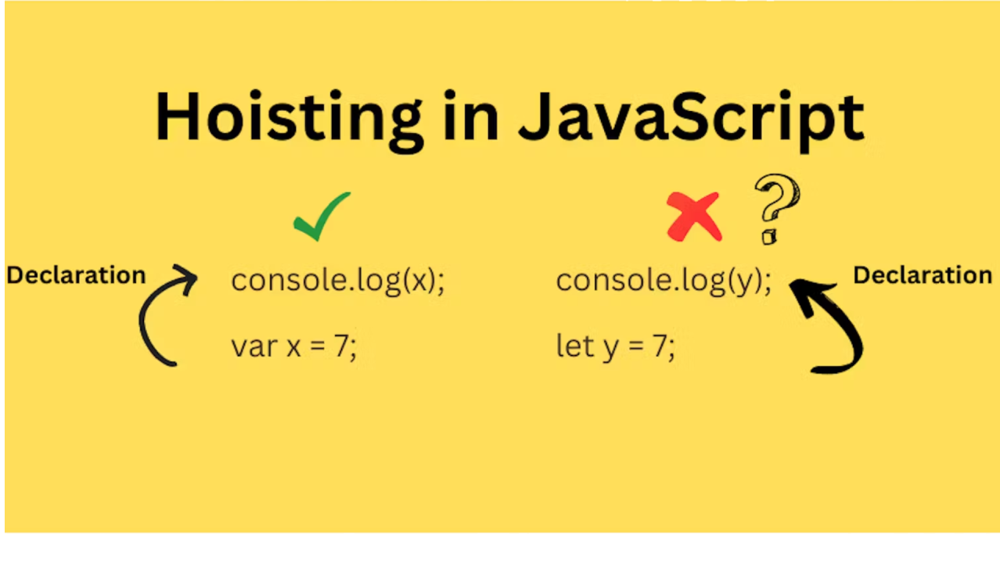

# hoisting

## What's the result of this log

```js
age = 19

console.log(age) // Result => 19

var age
```

and in this code

```js
// -1
age = 19

console.log(age) // Result => Cannot access 'age' before initialization

let age

// -2

number = 20
console.log(number); // Result => Missing initializer in const declaration
const number
```

#### why !?

#### JavaScript Hoisting refers to the process whereby the interpreter appears to move the declaration of functions, variables, classes, or imports to the top of their scope, prior to execution of the code

\*\* Tips : The variable we set in front of that value does not move example =>

```js
var variable = 20 // this variable not moving at all
```

<br/>



## How about this function call !!

```js
logger()

function logger() {
  console.log("Hello World")
} // Result => Hello World
```

but in this code

```js
// -1
sum()

let sum = () => {
  console.log(5 + 5)
} // Result => sum is not defined

// -2
logger()

const logger = () => {
  console.log("Hey John Doe")
} // Result => logger is not defined
```

<br/>
<hr/>
<br/>

# Question & Challenge

### Question 1

Whats the result of this code !?

```js
var age = 20

function logger() {
  console.log(age)
  var age = 20
}
```

<details>
  <summary>See Answer</summary>
  <p>The Answer is => undefined</p> 
  Because the variable inside the logger scope is set after log and the variable remains constant (not going to top)
</details>
