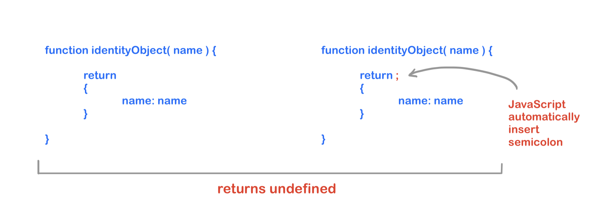

# ASI (Automatic Semicolon Insertion )

When you forget to add a semicolon to the end of a statement, JavaScript may still execute the code without throwing an error. This is because JavaScript automatically adds a semicolon to the end of the line in certain situations.

###

```js
// prettier-ignore
let numbers = [1, 2, 3]
["john" , "andy" , "sara"].forEach(person => {
    console.log(person)
}) // Result => VM66:2 Uncaught TypeError: Cannot read properties of undefined (reading 'forEach')
```

because i don't use semi when i write the variable named by `numbers` so my code is this =>

```js
//!! ------ Wrong code ❌
let numbers = [1, 2, 3][("john", "andy", "sara")].forEach((person) => {
  console.log(person)
}) // Result => VM66:2 Uncaught TypeError: Cannot read properties of undefined (reading 'forEach')

//!! -------- Current Code ✅
let numbers = [1, 2, 3]
;[("john", "andy", "sara")].forEach((person) => {
  console.log(person)
}) // Result => john andy sara
```

so using


